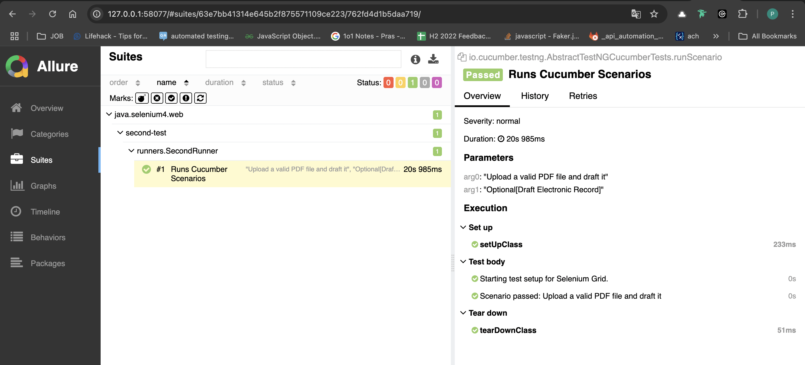
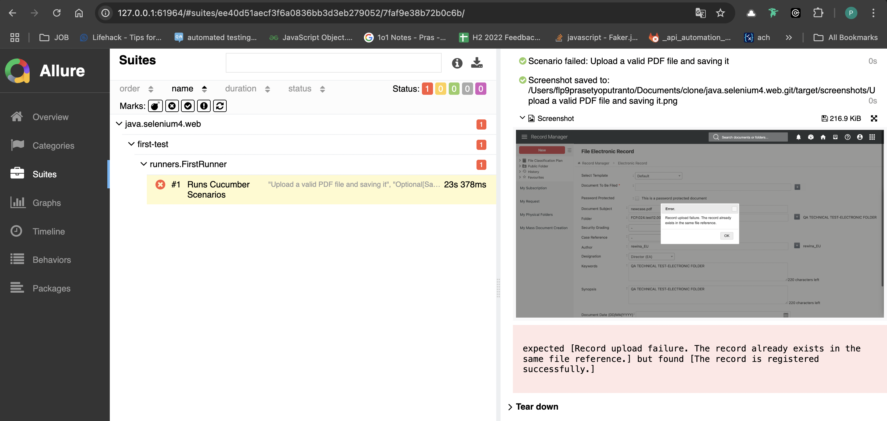

# Java Selenium 4 Web Project

## Project Overview

This project is a Java-based Selenium 4 web automation framework. It utilizes various libraries for testing and reporting.

## Dependencies

The following dependencies are included in this project:

- **Selenium Java**
    - **Group ID:** `org.seleniumhq.selenium`
    - **Artifact ID:** `selenium-java`
    - **Version:** `4.0.0`
    - **Maven Repository:** [Selenium Java](https://mvnrepository.com/artifact/org.seleniumhq.selenium/selenium-java)

- **Cucumber Java**
    - **Group ID:** `io.cucumber`
    - **Artifact ID:** `cucumber-java`
    - **Version:** `7.0.0`
    - **Maven Repository:** [Cucumber Java](https://mvnrepository.com/artifact/io.cucumber/cucumber-java)

- **Cucumber TestNG**
    - **Group ID:** `io.cucumber`
    - **Artifact ID:** `cucumber-testng`
    - **Version:** `7.0.0`
    - **Maven Repository:** [Cucumber TestNG](https://mvnrepository.com/artifact/io.cucumber/cucumber-testng)

- **WebDriverManager**
    - **Group ID:** `io.github.bonigarcia`
    - **Artifact ID:** `webdrivermanager`
    - **Version:** `5.9.3`
    - **Maven Repository:** [WebDriverManager](https://mvnrepository.com/artifact/io.github.bonigarcia/webdrivermanager)

- **Cucumber PicoContainer**
    - **Group ID:** `io.cucumber`
    - **Artifact ID:** `cucumber-picocontainer`
    - **Version:** `7.20.1`
    - **Maven Repository:** [Cucumber PicoContainer](https://mvnrepository.com/artifact/io.cucumber/cucumber-picocontainer)

- **Allure TestNG**
    - **Group ID:** `io.qameta.allure`
    - **Artifact ID:** `allure-testng`
    - **Version:** `2.13.9`
    - **Maven Repository:** [Allure TestNG](https://mvnrepository.com/artifact/io.qameta.allure/allure-testng)

- **Allure Java Commons**
    - **Group ID:** `io.qameta.allure`
    - **Artifact ID:** `allure-java-commons`
    - **Version:** `2.13.9`
    - **Maven Repository:** [Allure Java Commons](https://mvnrepository.com/artifact/io.qameta.allure/allure-java-commons)

## Install ##
- Install JDK 23
- Install Maven
- Install Docker(only selenium grid or jenkins)
- Install Allure on Mac, install via brew

## Screenshot and Record Link

Here is a screenshot of the test execution:

- pass test


- failed test


## Screen Record
`https://drive.google.com/drive/folders/1nnB_qxOAaIH9_q5f4ugRCpwO0F6AaDAP?usp=sharing`

## How to run test in jenkins or local
```bash
mvn clean package
```
```bash
mvn test
```

## How to build jenkins
- go to dir jenkins/docker-compose.yml
- run
```bash
docker-compose up
```
- setup jenkins until complete